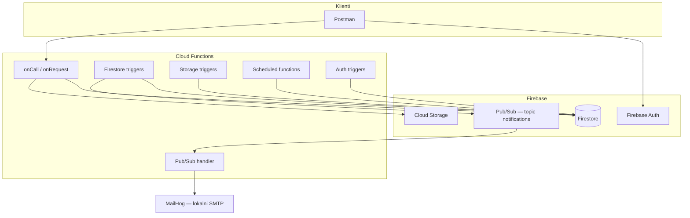

# CampusHub — brezstrežniški zaledni sistem (FaaS)

**CampusHub** je brezstrežniški backend za univerzitetni informacijski sistem: organizatorji objavljajo dogodke (delavnice, predavanja), študenti se prijavljajo, nalagajo gradiva, prejemajo obvestila, sistem pa samodejno opominja, arhivira in beleži pomembne dogodke.

**Tehnologije:** [Firebase](https://firebase.google.com/) (Auth, Firestore, Cloud Storage, Cloud Functions, Pub/Sub, Cloud Scheduler) · Node.js · lokalno testiranje z emulatorji, **Postman** in **MailHog**.

Predmet: ITA — IT Arhitekture · repozitorij: [Tanejb/faas](https://github.com/Tanejb/faas)

---

## Uradna navodila (shranjen povzetek)

- Implementacija brezstrežniškega zaledja s poudarkom na **FaaS**.
- Podprtih mora biti **vsaj 5 glavnih funkcionalnosti**, vsaka z več funkcijami.
- Sistem mora vključevati **avtentikacijo** in zaščitene funkcije.
- Uporabljeni morajo biti **vsaj 4 različni tipi dogodkov** (npr. DB, Storage, Messaging, časovni dogodki).
- Potrebna je uvedba in testiranje funkcij (lokalno z emulatorji in testni scenariji v Postmanu).

Ta repozitorij cilja te zahteve in jih mapira v poglavjih spodaj.

---

## Zakaj serverless / FaaS

| Zahteva brezstrežništva | Kako jo CampusHub izpolni |
|-------------------------|---------------------------|
| Brez upravljanja strežnikov | Firebase upravlja infrastrukturo |
| Samodejno prilagajanje | Functions se zaganjajo ob dogodkih |
| Stroški po uporabi | Plačilo po število invokacij (emulatorji lokalno brezplačno) |
| Visoka razpoložljivost | Google Cloud / Firebase SLA v produkciji |

---

## Arhitektura



**Tok podatkov (primer):** študent se prijavi na dogodek → zapis v Firestore → trigger `onRegistrationCreated` → sporočilo v Pub/Sub → `processNotification` pošlje e-pošto prek MailHog.

---

## 6 glavnih funkcionalnosti

Vsaka funkcionalnost je podprta z **več Cloud Functions** (callable, HTTP ali event-driven).

### 1. Avtentikacija in profili

| Funkcija | Tip | Opis |
|----------|-----|------|
| `onUserCreated` | Auth trigger | Ob registraciji ustvari profil v `users/{uid}` z vlogo `student` |
| `getMyProfile` | Callable | Vrne profil prijavljenega uporabnika |
| `updateMyProfile` | Callable | Posodobi ime, fakulteto, … |
| `setUserRole` | Callable (admin) | Spremeni vlogo (`student` / `organizer` / `admin`) |

**Varnost:** callable preveri `request.auth`; HTTP endpointi preverijo ID žeton; Firestore Security Rules omejijo neposreden dostop do baze.

---

### 2. Upravljanje dogodkov

| Funkcija | Tip | Opis |
|----------|-----|------|
| `createEvent` | Callable (organizer) | Ustvari dogodek (`draft`) |
| `publishEvent` | Callable (organizer) | Objavi dogodek (`published`) |
| `listEvents` | HTTP GET | Javni seznam objavljenih dogodkov |
| `getEventDetails` | HTTP GET | Podrobnosti enega dogodka |
| `onEventPublished` | Firestore trigger | Ob objavi sproži obvestila (Pub/Sub) |

**Firestore:** kolekcija `events/{eventId}`

---

### 3. Prijave na dogodke

| Funkcija | Tip | Opis |
|----------|-----|------|
| `registerForEvent` | Callable (student) | Prijava; preveri kapaciteto |
| `cancelRegistration` | Callable (student) | Odjava |
| `onRegistrationCreated` | Firestore trigger | Log + enqueue obvestilo organizatorju |
| `onRegistrationUpdated` | Firestore trigger | Ob spremembi statusa (npr. `confirmed` / `cancelled`) |

**Firestore:** `events/{eventId}/registrations/{registrationId}`

---

### 4. Datoteke in gradiva

| Funkcija | Tip | Opis |
|----------|-----|------|
| `getUploadUrl` | Callable | Navodila / metadata za nalaganje v Storage |
| `onMaterialUploaded` | Storage trigger | Ob nalaganju zapiše metapodatke v `materials` |
| `onMaterialDeleted` | Storage trigger | Počisti metapodatke v Firestore |

**Storage:** `events/{eventId}/materials/{fileName}`

---

### 5. Obvestila (async)

| Funkcija | Tip | Opis |
|----------|-----|------|
| `enqueueNotification` | interno / callable | Objavi sporočilo na Pub/Sub topic `notifications` |
| `processNotification` | Pub/Sub trigger | Pošlje e-pošto prek Nodemailer → MailHog |
| `onEventPublishedNotify` | Firestore trigger | Ob objavi dogodka enqueue “nov dogodek” |

**Pub/Sub topic:** `notifications` (emulator v `firebase.json`)

---

### 6. Avtomatizacija in poročila

| Funkcija | Tip | Opis |
|----------|-----|------|
| `sendEventReminders` | Scheduled (cron) | Dnevno: opomnik 24 h pred začetkom dogodka |
| `archiveOldEvents` | Scheduled (cron) | Tedensko: arhivira dogodke starejše od N dni |
| `generateWeeklyReport` | Scheduled (cron) | Tedensko: povzetek prijav v `reports` |

---

## 6 vrst dogodkov (sprožilci)

| # | Vrsta (navodilo) | Implementacija v CampusHub |
|---|------------------|----------------------------|
| 1 | **Podatkovne spremembe** | Firestore: `onDocumentCreated`, `onDocumentUpdated` |
| 2 | **Shramba in datoteke** | Cloud Storage: `onObjectFinalized`, `onObjectDeleted` |
| 3 | **Sporočila** | Pub/Sub: `onMessagePublished` na topic `notifications` |
| 4 | **Časovni dogodki** | Cloud Scheduler: `onSchedule` (cron) |
| 5 | **Uporabniški dogodki** | Firebase Auth: ob ustvarjanju uporabnika |
| 6 | **Integracijski / HTTP** | `onRequest` (seznam dogodkov) in `onCall` (zaščiteni API) |

Obvestila: **MailHog + Pub/Sub** (brez FCM push).

---

## Firestore — podatkovni model (osnutek)

```
users/{userId}
  - email, displayName, role, faculty, createdAt

events/{eventId}
  - title, description, startAt, endAt, capacity, status, organizerId, createdAt

events/{eventId}/registrations/{registrationId}
  - userId, status, registeredAt

materials/{materialId}
  - eventId, storagePath, fileName, uploadedBy, uploadedAt

reports/{reportId}
  - week, totalRegistrations, generatedAt

auditLogs/{logId}          (opcijsko, kasneje)
  - action, severity, metadata, timestamp
```

---

## Načrt implementacije

| Korak | Vsebina | Status |
|-------|---------|--------|
| 0 | Repo, README, Firebase konfiguracija, emulatorji, `health` | ✅ |
| 1 | Auth + profili + middleware | ✅ |
| 2 | Dogodki (CRUD) + Firestore rules | ⏳ |
| 3 | Prijave + Firestore triggerji | ✅ |
| 4 | Storage + triggerji | ✅ |
| 5 | Pub/Sub + MailHog | ✅ |
| 6 | Cron (opomniki, arhiv, poročilo) | ✅ |
| 7 | Postman kolekcija + testni scenariji | ⏳ |

---

## Začetna nastavitev (Firebase še ni ustvarjen)

### 1. Firebase projekt v konzoli

1. Odpri [Firebase Console](https://console.firebase.google.com/).
2. **Add project** → ime npr. `campus-hub` (ali poljubno).
3. Omogoči **Authentication** (Email/Password), **Firestore**, **Storage**.
4. V Project settings → **Service accounts** ni potreben za lokalne emulatorje.
5. V **Project settings** → **General** kopiraj **Project ID** in ga vpiši v `.firebaserc` (namesto `demo-campushub`).

> **Lokalno brez Firebase projekta:** privzeto je `demo-campushub` — emulatorji delujejo takoj. Pravi Project ID vpiši pred deployem v oblak.

### 2. Odvisnosti

```bash
npm install
cd functions && npm install && cd ..
```

### 3. Firebase CLI prijava (priporočeno)

```bash
npx firebase-tools login
```

Nato preveri aktivni projekt:

```bash
npx firebase-tools use
```

Če želiš delati brez prijave, uporabi `npm run emulators:demo`.

### 4. Node.js verzija (Windows)

Projekt je nastavljen na **Node 22** (`.nvmrc`, `engines.node`).

- Če uporabljaš `nvm-windows`: `nvm install 22.17.1` in `nvm use 22.17.1`
- Preveri: `node -v`

S tem izgine opozorilo o mismatch med zahtevano in globalno Node verzijo.

### 5. MailHog (Windows)

1. Prenos: [MailHog Releases](https://github.com/mailhog/MailHog/releases)
2. Zaženi `MailHog.exe` — UI: http://localhost:8025, SMTP: port **1025**

### 6. Emulatorji

```bash
npm run emulators
```

Če nisi prijavljen v Firebase CLI ali želiš 100% lokalni način brez produkcijskih klicev:

```bash
npm run emulators:demo
```

| Storitev | Naslov |
|----------|--------|
| Emulator UI | http://localhost:4001 |
| Functions | http://localhost:5001 |
| Firestore | localhost:8080 |
| Auth | localhost:9099 |
| Storage | localhost:9199 |
| Pub/Sub | localhost:8085 |

### 7. Preverjanje zdravja

```http
GET http://localhost:5001/faas-b43b4/us-central1/health
```

Za demo način:

```http
GET http://localhost:5001/demo-campushub/us-central1/health
```

Pričakovan odgovor: `{"status":"ok","service":"CampusHub"}`

---

## Struktura repozitorija

```
faas/
├── README.md                 ← ta dokument
├── package.json              ← firebase-tools (skripte)
├── firebase.json
├── .firebaserc               ← zamenjaj YOUR_PROJECT_ID
├── firestore.rules
├── firestore.indexes.json
├── storage.rules
├── functions/
│   ├── index.js              ← izvozi vse funkcije
│   ├── package.json
│   └── src/                  ← moduli po korakih
└── postman/                  ← kolekcija (korak 7)
```

---

## Testiranje

- **Postman** — glavni način klica HTTP in callable (z ID žetonom iz Auth emulatorja).
- **Firebase Emulator UI** — ročno dodajanje dokumentov, pregled Auth uporabnikov.
- **MailHog** — preverjanje poslanih e-poštnih obvestil.

Navodila za posamezne scenarije bodo v `postman/` (korak 7).

### Scheduled funkcije (cron) — lokalno testiranje

Časovni dogodki (`onSchedule`) se v produkciji sprožijo samodejno; lokalno jih ročno poženeš iz Emulator UI, da ni treba čakati na urnik.

1. Zaženi emulatorje: `npm run emulators`
2. Odpri **Functions** v Emulator UI: http://127.0.0.1:4001/functions
3. V seznamu poišči scheduled funkcije in klikni **Run function** (ali enakovreden gumb):
   - `sendEventReminders` — dnevni opomniki
   - `archiveOldEvents` — tedensko arhiviranje
   - `generateWeeklyReport` — tedensko poročilo prijav
4. Rezultat preveri v **Firestore** (http://127.0.0.1:4001/firestore):
   - `reports` — vsaka funkcija doda zapis z `type` (`daily_reminders`, `archive_old_events`, `weekly_registrations`)
   - `notifications` — pri `sendEventReminders` (če so izpolnjeni pogoji spodaj)

**Priprava testnih podatkov (priporočeno):**

| Funkcija | Kaj mora obstajati v Firestore |
|----------|--------------------------------|
| `sendEventReminders` | `events` z `status: "published"` in `startAt` v naslednjih **24 urah** (ISO niz, npr. jutrišnji datum) |
| `archiveOldEvents` | `events` z `status: "published"` in `endAt` **starejšim od ~30 dni** |
| `generateWeeklyReport` | vsaj ena prijava v `events/{eventId}/registrations` (`status: "registered"` ali `"cancelled"`) |

Če po ročnem zagonu v logu (zavihek **Logs** v Emulator UI) vidiš napako, preveri, da so emulatorji zagnani **po** zadnji spremembi `functions/index.js` (po potrebi `Ctrl+C` in ponovno `npm run emulators`).

---

## Povezave

- [ITA — predmetni repozitorij](https://github.com/HlisTilen/ITA)
- [Firebase Functions](https://firebase.google.com/docs/functions)
- [Firebase Emulator Suite](https://firebase.google.com/docs/emulator-suite)
- [MailHog](https://github.com/mailhog/MailHog)

---

## Avtor

Naloga ITA — FaaS / serverless. Javni repozitorij za oddajo.
